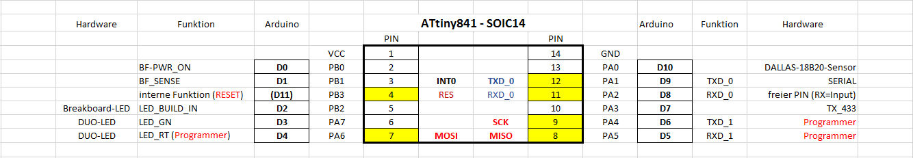
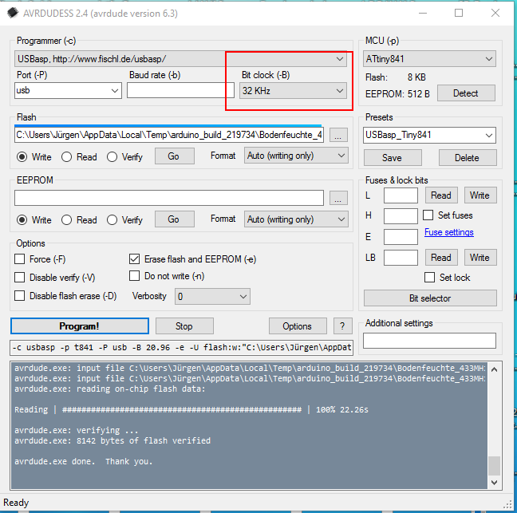

# Bodenfeuchte_ATtiny841
Soil-Moisture on 433 MHz sending with LaCrosse protocol

Library-Binding for ATtiny841:
http://drazzy.com/package_drazzy.com_index.json

ATtiny841 - Pinout:  

Programming via USBasp and Avrdude using avrdudess as GUI (Windows & Linux via Mono) 
https://github.com/juergs/Avrdudess

Avrdudess-Settings (set clock to 32KHz, higher clockrates won't work) 

Remarks:
Sketch uses 8142 bytes (99%) of program storage space. Maximum is 8192 bytes.
Global variables use 309 bytes (60%) of dynamic memory, leaving 203 bytes for local variables. 
Maximum is 512 bytes.

Narcoleptic + VCC-Reading specific to ATtiny841 only!

#Arduino 841-Support & Caveats:
https://github.com/SpenceKonde/arduino-tiny-841

#841 Hardware + Schematic:
https://www.tindie.com/products/DrAzzy/attiny84184-breakout-wserial-header-bare-board/

#1634 Hardware-Breakout
https://www.tindie.com/products/DrAzzy/attiny1634-breakout-wserial-header-bare-board/

